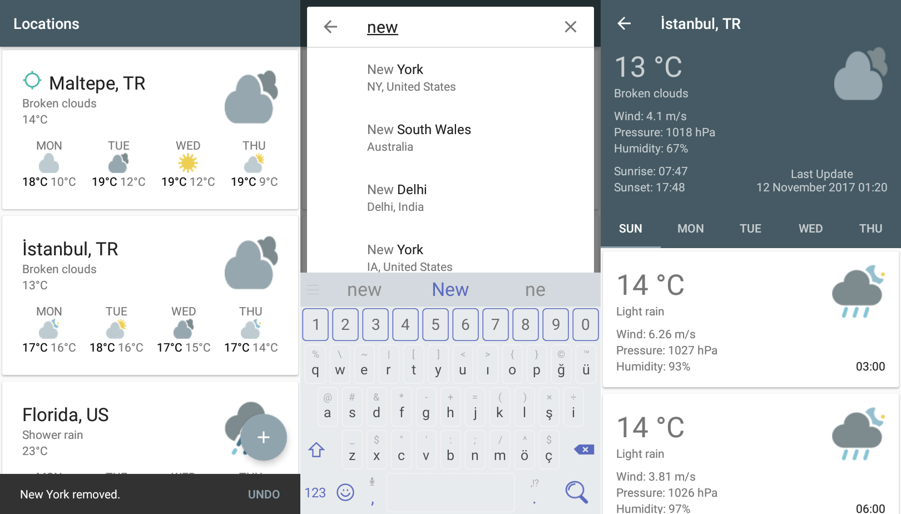

# WeatherPlus
An Advanced Weather Forecast App With [OpenWeatherMap](http://openweathermap.org/), [Google Places](https://developers.google.com/places/android-api/), [Play Services Location](https://developer.android.com/training/location/index.html) Apis.

## Features
* Simple design
* Location-based weather forecasting
* You can add your favorite cities/districts
* Detailed current (updates frequently) and 5 day forecasts
* Works with any city or district in the world
* Weather search for cities by keyword using Google Places API
* Offline functionality

## Screenshots

## Contribution
If you have any ideas or issues, don't hesitate to reach out to me. Every contribution is welcome.

## License

This application is Free Software: You can use, study share and improve it at your
will. Specifically you can redistribute and/or modify it under the terms of the
[Apache License 2.0](https://www.apache.org/licenses/LICENSE-2.0) license.
